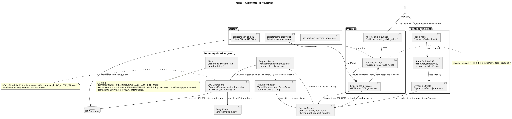
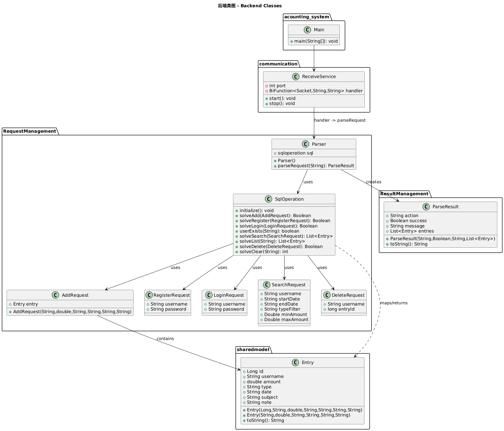
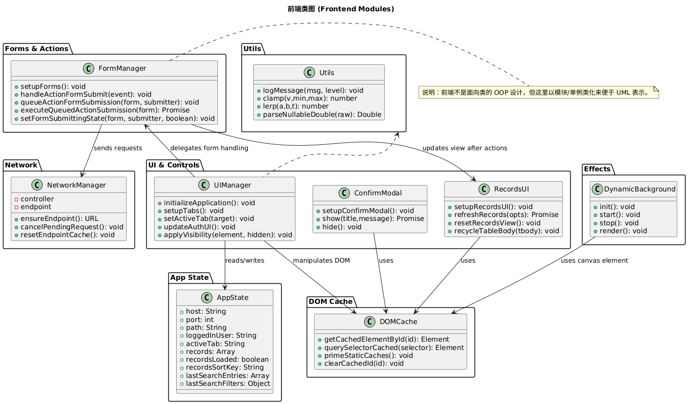
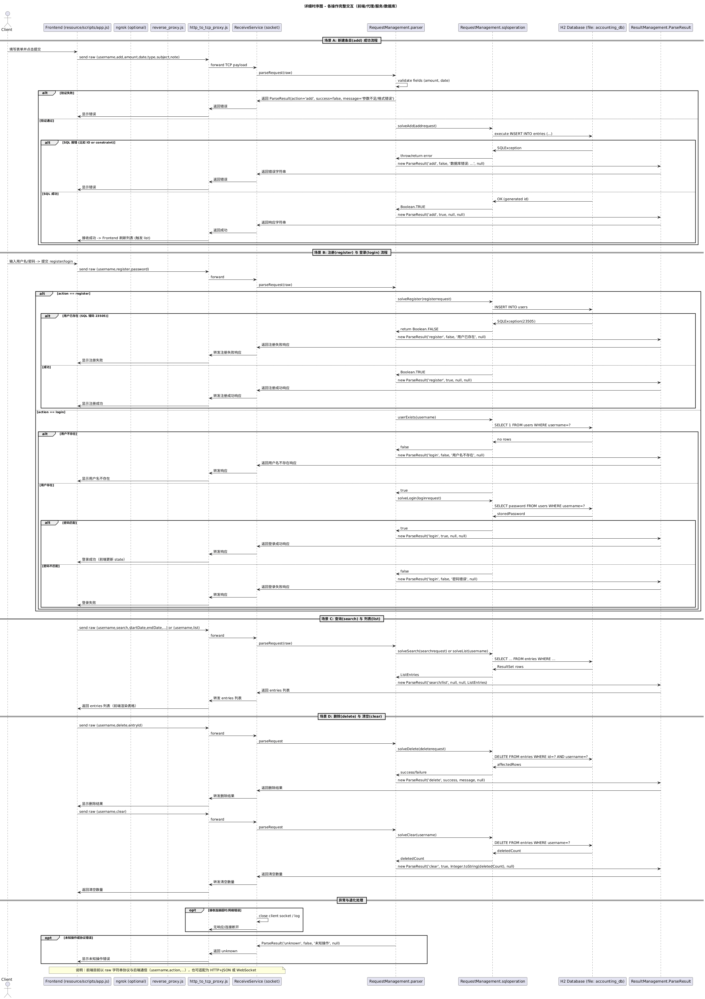
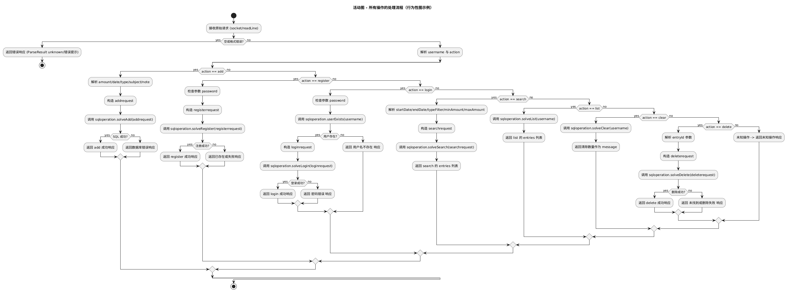
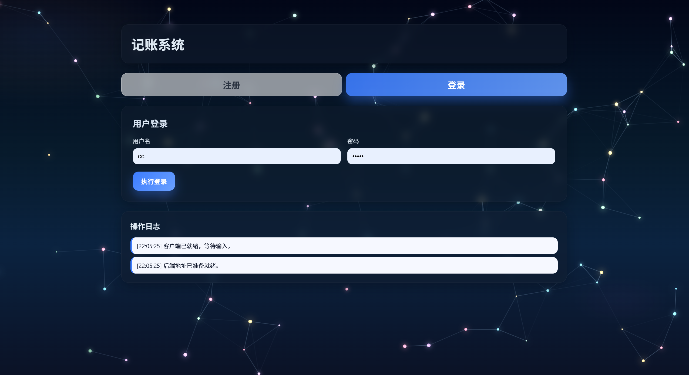
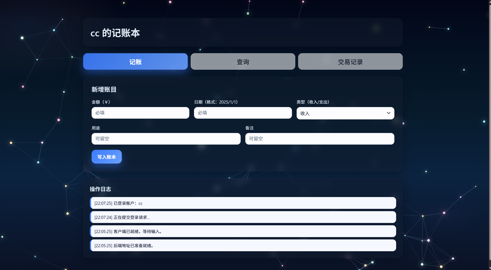
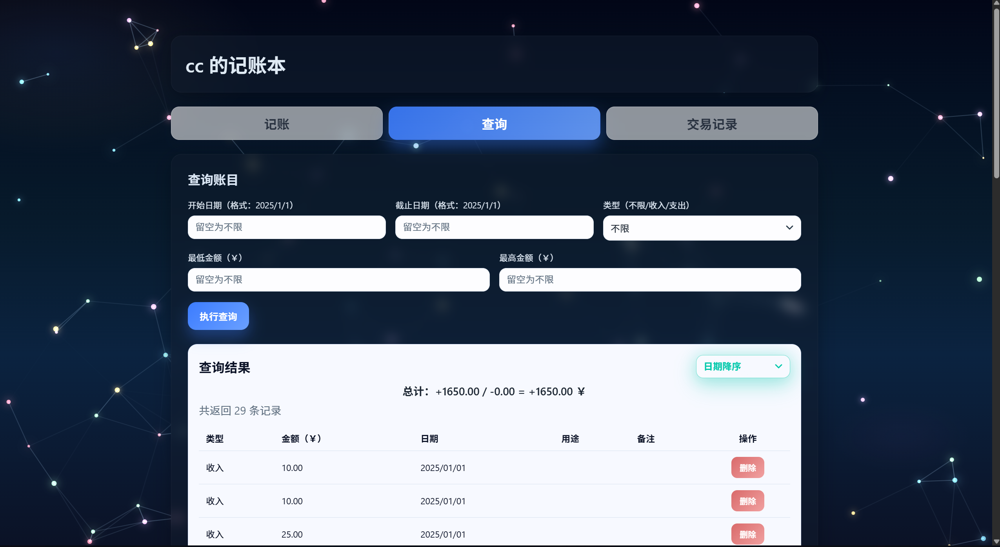
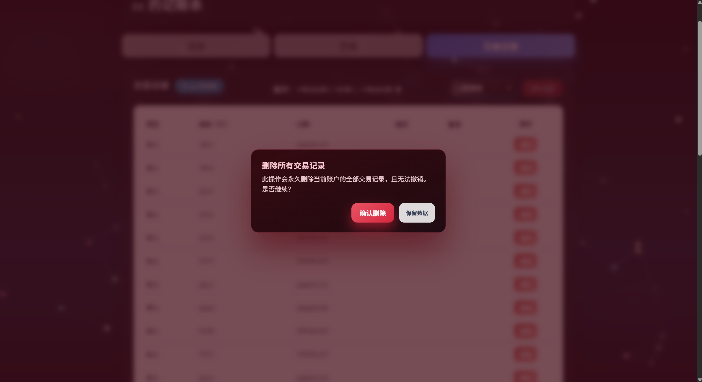

## 实验报告

### 一、软件主要功能

本软件为一套面向个人的网页版记账系统，支持多用户，主要用于录入、查询与管理日常收支记录。核心功能如下：

1. 记账（新增记录）
     - 输入收支类型、金额、时间、分类与备注，提交后保存到本地或后端数据库。
2. 查询/筛选
     - 支持按时间范围、分类、关键字进行查询.
3. 删除管理
     - 支持单条删除和全部删除两类操作；删除需有二次确认以防误删。

---

### 二、软件架构与 UML 图

- 功能/模块视图（组件图）：

设计说明与理由：
- 前端（UI）模块：负责用户交互、表单校验与展示。将界面层与业务逻辑分离，便于页面改动时不影响后端。
- 后端（服务）模块：负责请求处理、数据验证与持久化。采用清晰的接口设计，便于单元测试与后续扩展（例如增加权限模块）。
- 数据访问层（持久化）：集中管理与数据库（或本地存储）的读写，隔离 SQL/存储细节，便于替换或扩展存储方式。

模块之间采用典型的三层分离（表示层 - 业务层 - 数据层）以降低耦合度，满足后续扩展（例如增加统计、导出、远程同步等）。

说明：后端类图展示了请求解析、SQL 操作、结果解析等流程对应的类与方法划分。将请求解析与 SQL 操作分开，提升可测试性与可维护性。

说明：前端类图展示了各页面与控制器（或 JS 模块）间的关系，界面事件由控制层统一处理，视图层尽量仅负责展示。

此外，系统关键交互的时序与流程如下：

说明：时序图展示“用户提交记账 -> 前端校验 -> 后端接收并持久化 -> 返回结果 -> 前端反馈”的完整流程，明确了同步/异步边界与错误处理点。

说明：活动图展示典型使用场景（例如查询流程与删除确认流程），用于帮助开发人员与测试人员理解边界条件和异常处理分支。

---
### 三、各功能模块的 UI 界面与功能描述

下面逐一描述当前实现/设计中的主要界面，并引用界面截图以便展示实际风格与交互要点。

1) 注册与登录界面

功能描述：
- 用户可以在此处完成注册或登录。表单包含用户名、密码、确认密码（注册时）与登录按钮。
- 要点：表单字段需进行前端校验（非空、密码长度、确认密码一致）；登录失败应展示友好错误信息；成功登录后跳转到主界面并保存会话信息。

2) 记账界面（新增记录）

功能描述：
- 包含收支类型（收入/支出）、金额、日期时间、分类下拉、备注输入等控件。
- 要点：金额输入限制为数值；日期默认当前日期但可选择历史日期；提交后需展示成功/失败提示，并清空表单或保留输入以便继续录入。

3) 查询界面

功能描述：
- 提供时间范围选择、分类筛选、关键字搜索与查询按钮。
- 展示查询结果列表，并支持按金额/时间排序、分页或导出当前结果。

4) 单个删除界面

功能描述：
- 在查询结果或记录详情中触发单条记录删除，弹出二次确认对话框，确认后调用后端删除接口并刷新列表。

5) 全部删除界面

功能描述：
- 提供“全部删除”入口。
- 删除操作需多层确认以降低误删风险。

界面设计原则总结：

- 简洁清晰：关键操作优先级高，常用操作一目了然；
- 保护用户数据：删除、覆盖等危险操作需多次确认；
- 反馈及时：对于网络或持久化错误，给出明确原因与建议操作

---
### 四、大模型的使用

#### 1. UML 图代码生成

- 工具与目的：使用 deepseek 等基于提示的 UML 生成器辅助构造 PlantUML（.puml）代码，期望减少重复性手工书写并快速产出类图草稿。
- 遇到的问题：工具生成的 puml 代码有时包含语法错误或语义偏差（例如箭头方向、可见性标记、属性/方法格式不规范），导致 PlantUML 无法直接渲染或渲染结果与设计意图不符。
- 处理办法：对生成的代码进行人工校验与修正（修复转义字符、调整关系箭头、规范成员声明）。

#### 2. UI 界面设计工具

- 工具与用途：使用 GPT 类模型生成多套 UI 风格建议与基础 HTML/CSS/JS 模板，用于快速原型与风格对比。
- 优点：短时间内可获得多种风格参考。
- 缺点：模型通常输出“框架性”模板，对细粒度布局与元素间精确关系的控制有限。

#### 3. 利用 GPT 拓展相关知识

在配置和调试代理/隧道（例如 ngrok、反向代理）时，通过 GPT 快速获取配置建议、注意事项与调试思路，加快了问题定位与解决，但仍需在本地验证其建议的可行性。

#### 4. 思考与总结

- 优势：大模型适合头脑风暴、原型生成与多方案对比，能明显降低早期设计成本并加速迭代。
- 局限：生成内容在语法细节或业务上下文上可能出现偏差，需要人工审阅、测试与集成，不能完全替代人工设计和代码审查。
